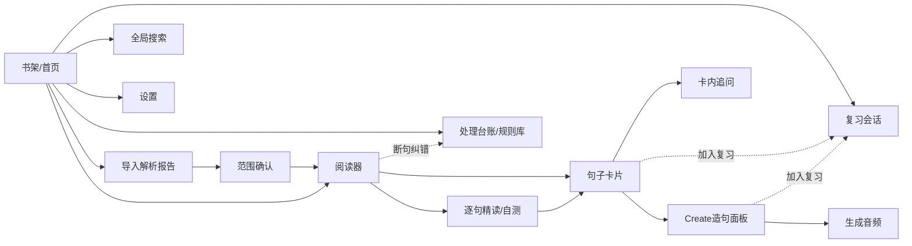

# 句读 (Judou) · 产品手册 (PRD)

> 一款 Windows 桌面端的、以「逐句精读 + 主动产出 + 间隔复习」为闭环的英文原著学习工具。
> 工作名 **句读**（古汉语中为文章断句之意，恰是本应用的核心动作）。备选英文名：Lectio / Cadence。

| 字段 | 内容 |
|---|---|
| 文档版本 | v0.1（初稿，供 Claude Design 出原型用） |
| 目标平台 | Windows 桌面（Tauri，单机本地优先） |
| 主要用户 | 作者本人（一名英语教师 / 英文原著读者），单人单机 |
| 关联文档 | 《02_架构方案_句读.md》 |

---

## 1. 产品定位与愿景

我在用 Calibre 读英文原版 EPUB 时会做标记、做笔记，但那套流程只解决「读」，不解决「学进脑子」。**句读** 不替代 Calibre 的阅读体验，它是一个**夯实英语基础的训练台**：把一本书拆成一句一句的「学习单元」，让我对每个句子完成「读懂 → 拆解 → 产出 → 复习」的完整学习闭环。

一句话定位：**把一本英文原著，变成一套可追溯、可讲解、可造句、可复习的个人语言训练材料。**

设计上明确对齐 **ICAP 学习框架**（Passive → Active → Constructive → Interactive，参与度递增、学习效果递增）：

- **P（被动）**：读句子。
- **A（主动）**：选句、标记「懂/没懂」、触发讲解、听音频。
- **C（建构）**：用学到的词/短语/句型，自己造一句「我真的会用到的句子」，并生成跟读音频。
- **I（交互）**：与人交流——**v1 暂不做**，作为后续方向（卡片内的 LLM 追问可视为部分代偿，但不是真正的 I）。

---

## 2. 目标用户与使用场景

- **用户**：英语功底已不错、但希望系统性精进的成年学习者（即作者本人）。技术上能接受配置 API Key。
- **典型场景**：
  1. 周末读一本英文小说 / 非虚构。读到一句没读懂，想彻底搞清语法和地道表达。
  2. 读到一个好用的短语或句型，想据为己有——自己用它造一句生活里用得上的话。
  3. 一周后，App 在我打开时提醒我：这些上周学的点该复习了。
- **设备形态**：单机桌面，本地优先。EPUB、笔记、卡片都存在本地；只有「我主动选中送去讲解/合成语音」的文本才会出网到 LLM/TTS。

---

## 3. 设计原则

1. **本地优先（Local-first）**：解析、断句、数据库、复习全部本地完成，离线可读可复习；联网仅用于 LLM 讲解与 TTS。
2. **可追溯（Traceable）**：任意一个句子都能回答「它属于这本书的哪一章 / 哪一节 / 哪一段」。这是数据模型的硬约束。
3. **自愈式健壮（Self-healing robustness）**：解析与断句不可能一次完美。所有异常 / 特殊处理都写进一个**「特殊处理登记台账」**；我处理得越多、沉淀的规则越多，整套解析就越健壮。这是产品的核心机制，不是附属功能。
4. **结构化优先（Structured-first）**：LLM 的讲解输出固定格式（结构化 JSON），保证可存储、可搜索、可复用，而不是一坨自由文本。
5. **ICAP 闭环**：每个功能都对应到 ICAP 的某一层，避免做成「只读不练」的又一个阅读器。

---

## 4. 核心概念与信息架构

数据自上而下的归属链（**可追溯链**）：

```
Book（书）
 └─ TOC Node（目录节点：章 / 节 / 小节，树形，可标注类型）
     └─ Paragraph（段落）
         └─ Sentence（句子 = 一个 entry，最小学习单元）
              └─ Card（卡片：1 个或多个句子的集合，深入探讨的容器）
                   ├─ Explanation（LLM 讲解，固定格式）
                   └─ Learning Point（学习点：词 / 短语 / 句型 / 搭配）
                        └─ Created Sentence（C 层：我的造句 + 英文呈现 + 音频）
                                              └─ SRS Item（进入间隔复习的可复习项）
```

**术语表**

| 术语 | 含义 |
|---|---|
| **Entry / 句子 (Sentence)** | 正文按标点断出的一个句子，最小学习单元，可追溯到段/节/章 |
| **目录节点 (TOC Node)** | 章、节、小节，树形结构。带「内容类型」标签：introduction / 推荐序 / 正文 / 仅标题（不入库） |
| **卡片 (Card)** | 深入探讨一个句子（或我选中的多个句子）的容器；承载讲解、学习点、追问 |
| **讲解 (Explanation)** | LLM 对卡片产出的固定四段式结果：语法 / 难点短语与词 / 整句翻译 / 通俗表达 |
| **学习点 (Learning Point)** | 从讲解中析出的可学习颗粒：一个生词、一个短语、一个语法/句型 |
| **造句 (Created Sentence)** | C 层产物：我输入中文，LLM 用该学习点把我的意思用英文呈现 |
| **复习项 (SRS Item)** | 进入 FSRS 间隔复习的对象（学习点 / 造句 / 句子，可选） |
| **处理台账 (Processing Log)** | 解析/断句过程中的异常与特殊处理记录，可沉淀为规则 |

---

## 5. ICAP 框架落地映射

| ICAP 层 | 在句读中的体现 | 对应模块 |
|---|---|---|
| Passive 被动 | 阅读句子原文 | 阅读器 |
| Active 主动 | 选句、标「懂/没懂」、触发讲解、播放音频、自测 | 阅读器 / 逐句精读 |
| Constructive 建构 | 用学习点**造我自己的句子**；生成跟读音频；复习时主动回忆并自评 | 卡片 Create 面板 / 复习 |
| Interactive 交互 | **v1 不做**（与人交流）。卡片内 LLM 追问为部分代偿 | （后续） |

> 设计要点：一个句子里可能有多个学习点（多个生词/短语/句型）。**每个学习点都应独立拥有自己的 C（造句）入口**，而不是整句只能造一句。但允许我**手动选择**哪些学习点值得「升级」为造句 / 进入复习，避免卡片爆炸（见 §7.5、§11 风险）。

---

## 6. 核心用户旅程（端到端）

1. **导入**：拖入一个 `.epub` → 解析进度 → 解析报告（识别出几章、几段、几句、几条异常；自动给目录节点打了 introduction/推荐序/正文/仅标题 的初判）。
2. **确认范围**：我在目录树上微调——确认哪些节点算正文/序言（入库断句），哪些只是标题栏（不入库）。可排除附录、版权页等。
3. **阅读**：进入阅读器，左侧目录树，中间句子流。两种模式：
   - 连续阅读（带段落上下文）
   - 逐句精读/自测（一次一句，先自问「读懂了吗」）
4. **遇到不懂**：对某句点「没读懂」→ 自动生成该句的**卡片**，并可一键送 LLM 讲解。也可**框选多句**合并成一张卡片送讲解。
5. **看讲解**：卡片里出现固定四段（语法 / 难点短语与词 / 整句翻译 / 通俗表达）+ 析出的学习点列表。可在卡片内继续向 LLM 追问。
6. **造句（C）**：对某个学习点，我输入一句中文（我生活里真会用的话）→ LLM 用这个词/短语/句型把它用英文呈现 → 我可微调 → 生成 TTS 音频，下载/跟读。
7. **复习（SRS）**：被我选中的学习点/造句进入复习队列。每次打开 App，首页提示今天该复习哪些；逐张复习、自评（Again/Hard/Good/Easy），可播放音频跟读。
8. **沉淀健壮性**：阅读/解析中发现的断句错误、脚注没滤干净等，进「处理台账」；我修正一次 + 可固化成一条规则，下次同类情况自动处理。

---

## 7. 功能模块详述（供原型设计）

### 7.1 书架 / 导入

- **书架**：网格展示已导入书籍（封面、书名、作者）。每本书显示进度徽标：总句数 / 已精读 / 卡片数 / 今日待复习。
- **导入**：拖拽或选择 `.epub`。导入即触发解析流水线（见 §7.2）。
- **解析报告**（导入后弹出）：
  - 概览：章节数、段落数、句子数、异常数。
  - 目录类型初判：每个目录节点旁标 `introduction / 推荐序 / 正文 / 仅标题(排除)`，可手动改。
  - 「进入确认」按钮 → 范围确认页。
- **边界情况**：重复导入（按文件 hash 去重，提示「已存在，是否覆盖/另存」）；非法/加密 EPUB（明确报错）；超大书（流式解析 + 进度）。

### 7.2 解析与断句（含特殊处理登记台账）

> 本模块的产品行为细节见架构文档 §3；此处描述用户可见的行为与控制。

- **入库范围**：只处理 introduction、推荐序、正文等**正文性内容**；**纯标题栏不作为句子入库**（但其文本仍作为 TOC 节点标题保留，用于追溯与导航）。
- **脚注 / 尾注过滤**：识别脚注引用标记与脚注正文（如 `epub:type="noteref"` / `aside epub:type="footnote"` / 传统 `<a href="#fnN">`），**从句子正文中剔除**，不让它污染句子。被剔除的内容记入台账，并可在卡片侧「查看原始脚注」（不丢信息，只是不混入句子）。
- **其他常见异常**（均记台账并可沉淀规则）：缩写（Mr. / e.g. / U.S.）、人名首字母（D. H. Lawrence）、小数与序号、引号跨句、对话、列表项、诗歌/引文排版、图注、页眉页脚残留等。
- **断句结果可纠正**：阅读时若发现某处断句不对（断多了/断少了），可在该处「合并句子 / 拆分句子」，操作即写入台账，并提示我「是否固化为规则」（例如把某缩写加入缩写词典）。
- **解析报告**：见 §7.1。

**特殊处理登记台账（Processing Log）—— 产品的健壮性核心**

- 一个集中页面（全局 + 按书过滤），列出所有解析/断句中的**异常**与**特殊处理**：阶段、位置（可点击跳回原文）、原始片段、采取的动作、是否已解决。
- 我可以：标记已解决 / 忽略 / **把这次处理升级为一条通用规则**（进入「规则库」）。
- 规则库（缩写词典、元素跳过规则、脚注识别规则等）随使用累积，越用越准。**这是「处理多了代码就健壮」的产品化落地。**

### 7.3 阅读器 / 逐句精读

- **三栏布局**：左=目录树（章/节/小节，带类型标签与待复习角标）；中=句子流；右=上下文/卡片预览（可收起）。
- **面包屑**：始终显示当前句所属 `书 > 章 > 节 > 段`。
- **两种模式**：
  - **连续阅读**：按段落显示句子，保留上下文，句子可悬浮高亮。
  - **逐句精读/自测**：一次聚焦一句，先「我读懂了吗？」自评（懂 → 下一句；没懂 → 生成卡片 / 送讲解）。
- **多句选择**：框选连续多句 → 「合并为一张卡片送讲解」（用于需要跨句才能理解的情况）。
- **状态可视**：每句有状态（未读 / 已读懂 / 有卡片 / 在复习中），用颜色或图标区分。

### 7.4 句子卡片（讲解）

每个句子（或多句选区）有自己的**专属卡片**，是深入探讨的容器。

- **卡头**：原句（多句则按序列出）+ 面包屑上下文 + 「查看原始脚注」（若有被剔除内容）。
- **LLM 讲解（固定四段，结构化）**：
  1. **语法**：句子结构 / 从句 / 时态语态 / 难点语法点。
  2. **难点短语与单词**：逐项列出（词/短语 + 释义 + 在本句中的含义/搭配）。
  3. **整句翻译**：准确中译。
  4. **通俗表达**：用更简单的英文改写本句（便于理解与内化）。
- **学习点列表**：从上面析出的可学习颗粒（词 / 短语 / 句型），每项可：加入复习、展开 C（造句）面板。
- **深入探讨（卡内追问）**：一个与本句绑定的 LLM 对话线程，可继续问「这里为什么用现在完成时」之类。对话归属于这张卡片，可保存可搜索。
- **重新讲解 / 版本**：允许换模型或换提示词重讲，保留历史版本。

### 7.5 Create（造句）+ TTS

- **位置**：在卡片每个**学习点**下展开一个 C 面板（一个句子多个学习点 → 多个 C 入口）。
- **流程**：
  1. 我输入一句**中文**（我生活/工作里真会用到的话）。
  2. LLM 用**这个学习点**（该词/短语/句型）把我的意思用**英文**呈现；并简短说明它如何用上了这个点。
  3. 我可微调英文；可让 LLM 再给 1–2 个变体。
  4. 「生成语音」→ 调 TTS → 得到音频（可播放 / 下载 / 跟读）。建议带**词级时间戳**做卡拉OK式高亮跟读（见架构 §6）。
- **取舍控制**：不强制每个学习点都造句。我手动选择值得练的点，避免卡片与复习项爆炸。
- **音频归属**：音频挂在「造句」（也支持给「原句」生成音频用于跟读）。

### 7.6 复习 / SRS（间隔复习）

- **算法**：FSRS-6（见架构 §7）。**不采用「我手动设频次」的旧 SuperMemo 思路**——改为：
  - 每个复习项有 FSRS 状态（稳定度/难度/到期日）。
  - 我的「掌握程度」通过每次复习的 **4 档自评（Again / Hard / Good / Easy）** 表达，由算法推导下次间隔。
  - 「频次」这个旋钮的真正形态是**每个 deck 的目标记忆保持率（desired retention，如 90%）**滑杆——调高=复习更勤、记得更牢但量更大；调低=更省力。这是比手动设频次更科学的控制方式。
- **启动提醒**：每次打开 App，首页/书架显示「今日待复习 N 项」。
- **复习会话**：逐项呈现 → 提示回忆（词义/用法/造句）→ 揭示答案 → 4 档自评 → 进入下一项。造句项可播放音频跟读。
- **复习对象**：可配置——学习点、我的造句、整句，三类都可入复习（默认：学习点 + 造句）。
- **统计**：今日完成 / 连续天数 / 各书掌握度概览 / 即将到期曲线。

### 7.7 搜索

- **全局全文检索**：跨句子原文、讲解、学习点、造句、卡内对话。
- **筛选**：按书 / 章节 / 学习点类型（词/短语/句型）/ 复习状态。
- 用途：快速回到「我上次学的那个短语」「含某个词的所有句子」。

### 7.8 设置

- **LLM**：多供应商 + API Key（本地加密存储），可选模型（OpenAI 兼容 / Anthropic / 国内如 DeepSeek、Qwen、智谱等）。可编辑/版本化**讲解提示词模板**与**造句提示词模板**。
- **TTS**：供应商与音色选择（推荐 ElevenLabs 质量优 / Azure Neural 便宜且带词级时间戳）；语速、是否保存词级时间戳。
- **复习**：每个 deck 的目标保持率、每日新卡上限、每日复习上限。
- **数据**：本地数据库位置、备份 / 导出 / 导入、清理音频缓存。

### 7.9 异常 / 处理日志中心

见 §7.2 末尾「特殊处理登记台账」。作为独立一级页面存在，是产品健壮性的可视化与操作入口。

---

## 8. 页面清单与导航地图（供 Claude Design）

| # | 页面 | 关键元素 | ICAP |
|---|---|---|---|
| 1 | 书架 / 首页 | 书籍网格、导入入口、今日待复习提醒、每书进度徽标 | — |
| 2 | 导入解析报告 | 解析概览、目录类型初判与编辑、异常计数 | — |
| 3 | 范围确认 | 目录树勾选正文/序言/排除标题 | — |
| 4 | 阅读器（连续） | 三栏：目录树 / 句子流 / 上下文，面包屑 | P / A |
| 5 | 逐句精读 / 自测 | 单句聚焦、懂/没懂自评、多句框选 | A |
| 6 | 句子卡片 | 原句、四段讲解、学习点列表、卡内追问 | A / C |
| 7 | Create 造句面板（卡内） | 中文输入→英文呈现→变体→生成音频 | C |
| 8 | 复习会话 | 单项呈现、揭示、4 档自评、音频跟读 | C |
| 9 | 处理台账 / 规则库 | 异常列表、跳回原文、固化规则 | — |
| 10 | 全局搜索 | 跨实体检索 + 筛选 | A |
| 11 | 设置 | LLM / TTS / 复习 / 数据 | — |

**导航地图（mermaid）**



---

## 9. 非目标 / v1 不做

- **ICAP 的 I（与人交流）**：暂不做（peer 互动、社群、共享）。
- 不做云同步 / 多端（本地优先；备份靠文件导出）。
- 不做 PDF / mobi / azw3（v1 只 EPUB）。
- 不替代 Calibre 的通读体验；句读专注「精读训练」。
- 不做账号体系（单人单机）。

---

## 10. 分阶段路线图（控制范围、先跑通闭环）

> 这是一个体量不小的产品。建议按 ICAP 闭环从「能用」到「好用」分阶段，避免一次性吞下。

- **MVP（A/P 闭环）**：EPUB 导入 → 解析/断句 + 可追溯 → 阅读器 → 单句/多句送 LLM → 固定四段讲解 + 学习点析出 + 卡片存储 + 处理台账（基础）。
- **v1（补 C）**：Create 造句（每学习点）→ TTS 生成/下载/跟读 → 全局搜索。
- **v1.5（补 SRS）**：FSRS-6 复习引擎、启动提醒、复习统计、目标保持率设置。
- **v2（健壮性与体验）**：规则库可视化与固化、断句 LLM 兜底、词级时间戳卡拉OK跟读、讲解版本管理、导入向导优化。
- **后续**：ICAP 的 I 层（与人交流）。

---

## 11. 风险与开放决策（需我拍板）

1. **断句永远做不到 100%**。接受「规则 + 异常台账 + LLM 兜底」的工程现实，台账是必需品而非可选项。
2. **学习点/造句可能爆炸**。坚持「手动选择哪些点升级为造句/复习」，否则复习负担失控。
3. **SRS 用 FSRS 而非手动频次**：是否接受用「目标保持率滑杆 + 4 档自评」替代「我手动设复习频次」？（强烈建议接受。）
4. **LLM 供应商**：默认接哪几家？（建议：一个海外 OpenAI 兼容 + 一个国内便宜模型做日常讲解。）需我提供 Key。
5. **TTS 供应商**：跟读质量优先选 ElevenLabs，省钱+词级时间戳选 Azure Neural。二选一或都接？
6. **复习对象默认集合**：默认「学习点 + 造句」入复习，整句可选。是否认可？
7. **范围（章节类型）自动判定的准确度**：自动初判 + 我人工确认。是否接受导入时多一步「范围确认」？

> 以上 7 条建议在原型评审时逐条确认，确认后即可冻结进入开发。
