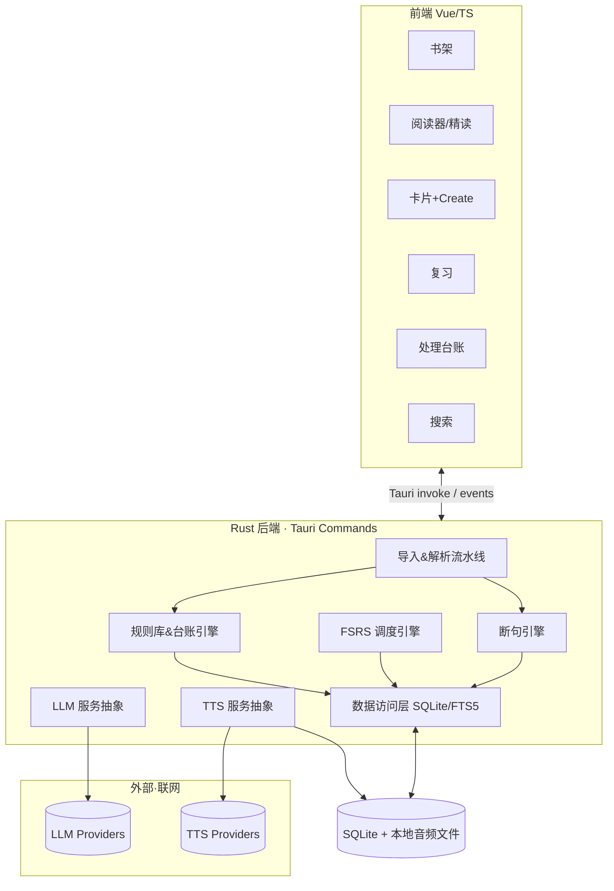
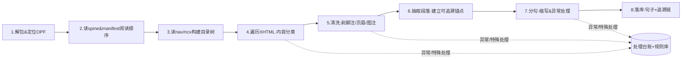
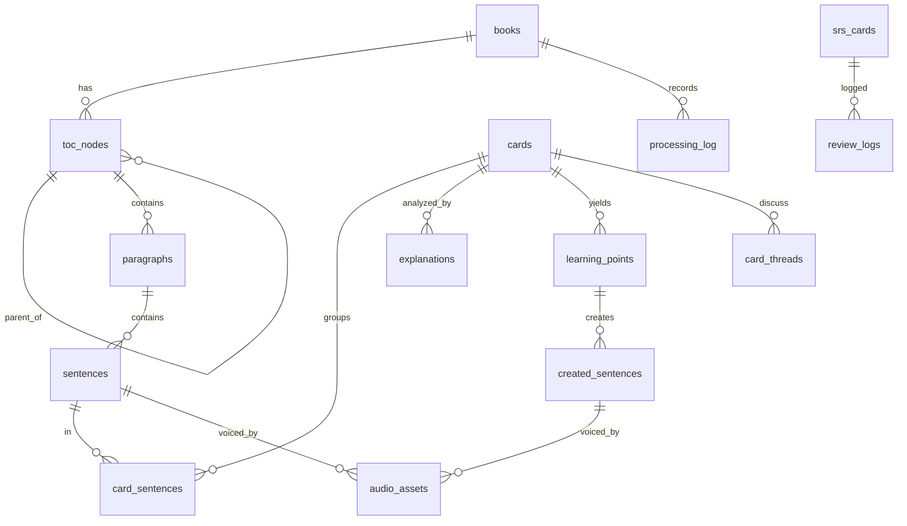
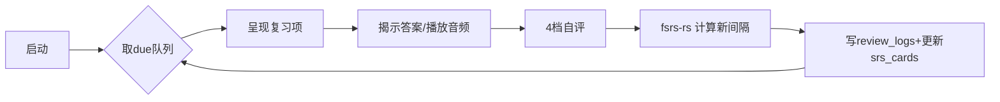

# 句读 (Judou) · 架构方案

> 配套《01_产品手册_句读.md》。本文给出技术选型、解析/断句流水线、数据模型、LLM/TTS/SRS 集成与关键风险。
> 设计取向：**本地优先、可追溯、结构化、自愈式健壮**。

| 字段 | 内容 |
|---|---|
| 文档版本 | v0.2 |
| 目标平台 | Windows 桌面（Tauri 2.x） |
| 部署形态 | 单机本地，无服务端；联网仅用于 LLM / TTS |

---

## 1. 技术栈选型与理由

| 层 | 选型 | 理由 |
|---|---|---|
| 桌面壳 / 后端 | **Tauri 2.x + Rust** | 你已有 Tauri+Vue 经验（CarConfig）；包体小、本地优先、Rust 适合做 EPUB 解析、断句、SRS 计算、SQLite 访问；FSRS 有原生 Rust 实现 |
| 前端 | **Vue 3 + TypeScript + Vite** | 复杂交互（三栏阅读器、卡片、复习）需要成熟前端框架；Phase 0 已按 Vue 路线落地 |
| 本地数据库 | **SQLite**（`sqlx` 或 `rusqlite`）+ **FTS5** 全文检索 | 单机、零运维、事务可靠；FTS5 满足「保存与搜索」 |
| EPUB 解析 | Rust：`zip` + `quick-xml` +（HTML）`lol-html`/`scraper`/`kuchikiki` | EPUB 本质是 zip+XHTML+OPF/NCX；Rust 侧解析性能好、可控 |
| 断句 | Rust 规则分句（pragmatic_segmenter 思路）+ 缩写词典 + **LLM 兜底** | 纯规则达不到 100%（WSJ 中约 47% 的句点不是句末）；兜底+台账是务实解 |
| SRS | **FSRS-6**，`fsrs-rs`（Rust，含调度+训练/优化） | 当前业界 SOTA，Anki 默认；同语言栈、可本地训练个人参数 |
| LLM | 供应商无关抽象层（OpenAI 兼容 / Anthropic / 国内模型） | 讲解+造句+追问；结构化 JSON 输出 |
| TTS | 供应商无关（ElevenLabs / Azure Neural / OpenAI…） | 跟读重音质与词级时间戳，而非低延迟 |
| API Key 存储 | OS 凭据库（Windows Credential Manager，经 `keyring` crate）或本地加密 | 不明文落盘 |

---

## 2. 系统总体架构



后端以 Tauri command 暴露能力；长任务（解析、批量讲解、TTS）走异步 + 进度事件回传前端。

### 2.1 Phase 0 工程落地结构

当前代码骨架按路线图 Phase 0 落地，保持「前端调用薄、后端分层清楚、测试先行」：

```text
judou/
├─ package.json / vite.config.ts / tsconfig.json
├─ src/
│  ├─ api/                  # 类型化 IPC 客户端；ping 已接入 invoke + event listen
│  ├─ assets/design/        # 运行时设计 token（由 reference 整理而来）
│  ├─ __tests__/            # Vitest
│  └─ App.vue               # Walking Skeleton 首屏
├─ src-tauri/
│  ├─ migrations/0001_init.sql
│  ├─ src/
│  │  ├─ commands/          # Tauri command 薄层；ping 已 emit ping://pong
│  │  ├─ db.rs              # SQLite migration runner
│  │  ├─ ingest/epub.rs     # EPUB container.xml、OPF、NCX、内容分类、段落抽取
│  │  ├─ repo/              # 数据访问层；books/toc_nodes/paragraphs 落库与追溯查询
│  │  ├─ clock.rs           # Clock / SystemClock / FixedClock
│  │  ├─ llm.rs             # LlmProvider / MockLlm
│  │  └─ tts.rs             # TtsProvider / MockTts
│  └─ tests/                # Phase 0 集成验收
└─ docs/design/             # 设计规格、原型 HTML、截图与 support.js 留档
```

设计资产约定：
- `src/assets/design/tokens.css` 是应用运行时唯一直接导入的设计 token 源。
- `docs/design/` 保存 Claude Design 产出的规格、原型与截图，作为后续 UI 开发对照，不参与运行时打包。
- 原始 `reference/` 可视为导入暂存区；进入开发时应同步到上述两个位置。

### 2.2 Phase 1 EPUB 解析落地边界

Phase 1 当前采用「真实书少量章节 + 纯函数 + repo 落库」推进：

- `ingest::epub::read_package_document`：从 EPUB ZIP 读取 `META-INF/container.xml`，定位 OPF，解析 metadata、manifest、spine 与 NCX href。
- `ingest::epub::parse_ncx_toc`：解析 EPUB2 `toc.ncx` 为嵌套 `TocNode` 树，保留 `href#anchor`、`level`、同级 `order_index`。
- `ingest::epub::classify_toc_nodes`：基于标题和层级做最小内容类型初判；`Part ...` 且含子节点为 `title_only`，封面/版权/目录/notes/index 等为 `excluded`，Introduction 为 `introduction`，Chapter/Interlude 默认为 `body`。
- `ingest::epub::extract_paragraphs_from_xhtml`：从指定 XHTML 抽取正文段落，跳过章节号/标题等短文本，输出 `source_href + source_path + clean_text`。
- `repo::SqliteRepo`：唯一负责写入 `books/toc_nodes/paragraphs`，并提供段落 `paragraph -> toc_node -> book` 追溯查询。
- `commands::import_epub`：按 IPC 契约创建异步导入任务，写入 Tauri app data 下的 `judou.sqlite3`，通过 `import://progress`、`import://done`、`import://error` 回传状态；`import://done` 携带 `ImportReport`。
- `commands::get_import_report`：从本地库重建导入报告，避免 UI 只能依赖导入完成事件中的一次性 payload。

当前 fixture 使用 `fixtures/epub/Inside the Box - David Epstein.epub`，测试只读取 OPF/NCX 与第一章 `OEBPS/c6U.xhtml`，避免整本解析耗时。

### 2.3 Phase 2 断句与台账落地边界

Phase 2 当前先落地规则断句主路径和核心不变量：

- `segment::segment_paragraph`：规则分句，保护 `Mr.`、`Dr.`、`e.g.`、`i.e.`、`U.S.`、人名首字母与小数点等常见非句末句点。
- `segment::segment_paragraph_with_notices`：返回句子和特殊处理 notices；用于把缩写/小数等规则命中写入台账。
- 断句输出保留源段落字符，测试守护 `sentences.text` 拼接后等于原段落文本，避免断句改写原文。
- `repo::insert_sentences`：写入 `sentences`，包含 `start_offset`、`end_offset`、`segmentation_method=rule`、`status=unread`。
- `repo::segment_book_paragraphs`：导入后对段落批量断句，并把规则命中的特殊处理写入 `processing_log(stage='segment')`。
- `repo::find_sentence_trace`：验证 `sentence -> paragraph -> toc_node -> book` 追溯链。

当前 `ImportReport` 已包含 `sentences_imported`。Phase 2 后续还需要补规则库版本化、人工合并/拆分和更完整的低置信识别。

---

## 3. EPUB 解析与断句流水线（核心）

EPUB = ZIP 容器，内含：`container.xml`（定位 OPF）、`content.opf`（manifest 清单 + spine 阅读顺序 + 元数据）、`toc.ncx` 或 `nav.xhtml`（目录）、若干 XHTML 正文。

流水线分阶段，**每阶段都向「处理台账」写记录**，异常不中断、可回溯、可沉淀规则：



**阶段要点**

1. **解包 / 定位**：`META-INF/container.xml` → OPF 路径。
2. **阅读顺序**：OPF `spine` 给出 XHTML 的正确顺序（不要靠文件名）。
3. **目录树**：解析 `nav.xhtml`（EPUB3）或 `toc.ncx`（EPUB2），得到 `章/节/小节` 树及每个节点的 `href#anchor`。把章节标题与正文内容用 anchor 对齐。
4. **内容分类**：对每个目录节点/区块做**内容类型初判**：`introduction / 推荐序(preface/foreword) / 正文(body) / 仅标题(title-only) / 排除(版权页/附录/索引…)`。判据：nav 中的 `epub:type`（`bodymatter`/`frontmatter`/`titlepage`/`copyright-page` 等）、标题文本启发式、节点下文本量。结果**可被用户在「范围确认」页改写**。仅标题/排除节点**不入库为句子**，但其标题文本作为 TOC 节点保留（供追溯导航）。
5. **清洗（关键·脚注过滤）**：
   - 脚注引用标记：`<a epub:type="noteref">`、`<sup><a href="#fnN">`、`role="doc-noteref"`。
   - 脚注/尾注正文：`<aside epub:type="footnote">`、`<li id="fnN">`、独立尾注页。
   - **从句子正文中剔除**这些标记与正文，但**原文留档**（挂到来源段落，卡片侧可「查看原始脚注」），不丢信息。
   - 同时剥离：页眉页脚残留、图注（`figcaption`）、表格、纯导航链接、装饰性元素。
   - 每一次剔除都写台账（阶段=clean，记录被剔片段与所用规则）。
6. **段落抽取 + 追溯锚点**：以块级元素（`<p>` 等）为段落单位。每段记录来源 `href`、元素路径（如 CSS/XPath 选择器或 DOM 路径）、在节点内的序号 → 形成 `句子→段→目录节点→书` 的硬追溯链。
7. **分句**：
   - **主路径**：规则分句（pragmatic_segmenter 思路的 Rust 实现）+ **缩写词典**（Mr./Dr./e.g./i.e./U.S./etc. 及人名首字母）+ 小数/序号/引号跨句/对话等规则。
   - **兜底**：对规则标为「低置信」的段落（如含异常标点、超长、引号不闭合），可调用 **LLM 分句**（给定段落，要求只输出句子边界，不改写文本）作为兜底；结果入台账标注来源=LLM。
   - 句子保存原文 + 规范化文本 + 段内偏移；记录 `segmentation_method`（rule / llm / manual）。
   - **可纠正**：阅读器中「合并/拆分」操作写回 `sentences` 并入台账，可固化为规则（如把某缩写加入词典）。
8. **落库**：写入 `books / toc_nodes / paragraphs / sentences`，建立 FTS5 索引。

**处理台账 + 规则库**（健壮性机制）

- `processing_log`：记录每条异常/特殊处理（阶段、位置、原始片段、动作、来源 rule/llm/manual、是否已解决）。
- `processing_rules`：可启用/版本化的规则（缩写词典项、元素跳过选择器、脚注识别模式…）。用户在台账里「把一次处理升级为规则」即写入此表，后续解析自动应用 → **越用越健壮**。

---

## 4. 数据模型（SQLite）

> 命名用 snake_case；时间统一存 UTC。`*_json` 为结构化 JSON 字段。下为逻辑模型，落地时补索引与约束。



**核心表**

`books`
| 字段 | 类型 | 说明 |
|---|---|---|
| id | PK | |
| title / author / language | text | EPUB 元数据 |
| file_hash | text unique | 去重 |
| cover_path | text | 本地封面 |
| metadata_json | json | 出版信息等 |
| imported_at | datetime | |

`toc_nodes`（自引用树：章/节/小节）
| 字段 | 类型 | 说明 |
|---|---|---|
| id | PK | |
| book_id | FK | |
| parent_id | FK nullable | 树形 |
| title | text | 节点标题 |
| level | int | 1=章,2=节… |
| order_index | int | 同级顺序 |
| spine_href / nav_anchor | text | 来源定位 |
| content_type | enum | introduction/preface/body/title_only/excluded |
| included | bool | 是否入库断句 |

`paragraphs`
| 字段 | 类型 | 说明 |
|---|---|---|
| id | PK | |
| book_id / toc_node_id | FK | 归属 |
| order_index | int | 节点内顺序 |
| source_href / source_path | text | 来源 XHTML 与元素路径（追溯） |
| clean_text | text | 清洗后段落文本 |
| raw_html | text nullable | 原始片段（可选留档） |

`sentences`（= entry，最小学习单元）
| 字段 | 类型 | 说明 |
|---|---|---|
| id | PK | |
| book_id / paragraph_id | FK | **追溯链：→段→节点→书** |
| order_index | int | 段内顺序 |
| text | text | 句子原文 |
| normalized_text | text | 规范化（搜索用） |
| start_offset / end_offset | int | 段内字符偏移 |
| segmentation_method | enum | rule/llm/manual |
| status | enum | unread/read/understood/flagged |

`processing_log`（特殊处理台账）
| 字段 | 类型 | 说明 |
|---|---|---|
| id | PK | |
| book_id | FK | |
| stage | enum | classify/clean/segment/other |
| severity | enum | info/warn/error |
| location_ref | text | 可跳回原文（href+path/offset） |
| raw_snippet | text | 原始片段 |
| action_taken | text | 采取的动作 |
| source | enum | rule/llm/manual |
| rule_id | FK nullable | 关联规则 |
| resolved | bool | |

`processing_rules`（规则库）
| 字段 | 类型 | 说明 |
|---|---|---|
| id | PK | name / stage / pattern / action / enabled / version / notes |

**学习层**

`cards`（卡片：1 或多句的容器）
| id PK · book_id FK · note text · created_at |

`card_sentences`（卡片↔句子，多对多，支持多句选区）
| card_id FK · sentence_id FK · order_index |

`explanations`（LLM 固定四段讲解，允许多版本）
| 字段 | 类型 | 说明 |
|---|---|---|
| id | PK | |
| card_id | FK | |
| model / prompt_version | text | 可追溯哪次哪模型 |
| grammar_json | json | 语法（结构化） |
| phrases_json | json | 难点短语与词（列表） |
| translation | text | 整句翻译 |
| plain_rephrase | text | 通俗表达 |
| raw_json | json | 原始完整返回 |
| created_at | datetime | |

`learning_points`（学习点：词/短语/句型）
| 字段 | 类型 | 说明 |
|---|---|---|
| id | PK | |
| card_id | FK | |
| source_explanation_id | FK | 来源讲解 |
| type | enum | word/phrase/grammar/collocation/pattern |
| surface | text | 表层形式 |
| lemma | text nullable | 词元 |
| definition / note | text | |
| promoted | bool | 是否升级（造句/复习） |

`created_sentences`（C 层：我的造句）
| 字段 | 类型 | 说明 |
|---|---|---|
| id | PK | |
| learning_point_id | FK | 归属学习点（一点可多句） |
| zh_input | text | 我的中文 |
| en_output | text | LLM 英文呈现 |
| model / prompt_version | text | |
| note | text | LLM 对「如何用上该点」的说明 |

`audio_assets`（TTS 产物）
| 字段 | 类型 | 说明 |
|---|---|---|
| id | PK | |
| owner_type | enum | sentence / created_sentence |
| owner_id | int | 多态归属 |
| provider / voice | text | |
| file_path | text | 本地音频 |
| duration_ms | int | |
| word_timings_json | json nullable | 词级时间戳（跟读高亮） |

`card_threads`（卡内追问对话）
| id PK · card_id FK · role enum(user/assistant) · content text · created_at |

**复习层（FSRS）**

`srs_cards`（包裹任意可复习项）
| 字段 | 类型 | 说明 |
|---|---|---|
| id | PK | |
| item_type | enum | learning_point / created_sentence / sentence |
| item_id | int | 多态指向 |
| deck_id | FK | |
| stability / difficulty | real | FSRS 记忆变量 |
| due | datetime | 到期日 |
| state | enum | new/learning/review/relearning |
| reps / lapses | int | |
| last_review | datetime | |
| suspended | bool | |

`review_logs`（FSRS 训练/优化必需）
| id PK · srs_card_id FK · rating enum(again/hard/good/easy) · reviewed_at · elapsed_days · scheduled_days · state_before_json |

`decks`
| id PK · name · desired_retention real(默认0.9) · daily_new_limit · daily_review_limit |

**全文检索（FTS5）**
- 在 `sentences.text`、`explanations`（translation/plain_rephrase/phrases）、`learning_points.surface/definition`、`created_sentences`、`card_threads.content` 上建 FTS5 虚拟表，触发器同步。满足跨实体搜索。

**关键索引**：`sentences(paragraph_id, order_index)`、`toc_nodes(book_id, parent_id, order_index)`、`srs_cards(due, suspended)`（复习队列）、`processing_log(book_id, resolved)`。

---

## 5. LLM 集成

**抽象层**：定义统一 `LlmProvider` trait，适配 OpenAI 兼容（含国内 DeepSeek/Qwen/智谱/Moonshot 等多为 OpenAI 兼容）与 Anthropic。配置：base_url、model、key（OS 凭据库）。支持讲解/造句/分句兜底/追问四类调用，均可指定提示词版本。

**讲解：固定四段结构化输出**（要求模型只返回 JSON，便于存储与搜索）。建议 schema：

```json
{
  "grammar": {
    "structure": "主句 + that 引导的宾语从句…",
    "points": [{"label": "现在完成时", "explain": "…", "span": "has never sold"}]
  },
  "phrases": [
    {"surface": "account for", "lemma": "account for", "type": "phrase",
     "meaning_here": "解释/占比", "note": "常见搭配…"}
  ],
  "translation": "准确的整句中译。",
  "plain_rephrase": "A simpler English version of the sentence."
}
```
- 入库时拆分：`translation`/`plain_rephrase` 直存；`phrases` 逐项落 `learning_points`；`grammar` 存 `grammar_json`。
- 多句选区：把多句拼为一个上下文块送入，输出仍为同一 schema，挂到一张 card。

**造句（C 层）提示词要点**：输入 = 学习点(surface/type) + 我的中文句。要求：用该学习点把中文意思用地道英文呈现；附一句「如何用上了该点」；可给 1–2 变体。输出 JSON：`{ "english": "...", "variants": ["..."], "usage_note": "..." }`。

**分句兜底提示词**：给定段落，仅输出句子边界（如返回每句的起止 offset 或句子数组），**禁止改写或增删文本**，避免污染原文。

**缓存与复用**：讲解/造句结果全部入库；同卡重复不再请求（除非显式「重新讲解」）。提示词模板版本化（`prompt_version`），便于日后比较与回溯。

---

## 6. TTS 集成

**目标**：跟读用——重**自然韵律**与**词级时间戳**（卡拉OK式高亮），不追求低延迟。

| 供应商 | 适配建议 |
|---|---|
| **ElevenLabs** | 音质/表现力最佳；有带时间戳的合成端点，适合跟读高亮。成本偏高。 |
| **Azure Neural TTS** | 便宜（Neural ~$12/100万字符）、支持 SSML 与 **word boundary 事件**（天然出词级时间戳），多音色。性价比首选。 |
| **OpenAI gpt-4o-mini-tts** | 便宜、同 LLM 一套 Key、集成简单；音色与词级时间戳能力较弱。 |

**架构**：与 LLM 同构的 `TtsProvider` 抽象。流程：造句/原句文本 → 调 TTS → 落本地音频文件 + 写 `audio_assets`（含 `word_timings_json`）。前端播放时用时间戳做逐词高亮，支持下载与变速跟读。

**建议默认**：Azure Neural（性价比 + 词级时间戳）为默认，ElevenLabs 作为「高质量」可选。二者均供应商无关接入。

---

## 7. SRS 引擎（FSRS-6）

**为什么不是手动设频次 / 老 SM-2**：FSRS 为每张卡建模三个变量——稳定度(stability)、难度(difficulty)、可提取性(retrievability)，用个人复习历史拟合参数，同等记忆保持下比 SM-2 少约 20–30% 复习量，且 Anki 已默认采用。`fsrs-rs` 提供 Rust 的调度 + 优化（可基于 `review_logs` 本地训练个人参数），与本栈无缝。

**落地**：
- 任意可复习项（学习点 / 造句 / 整句）包成一条 `srs_cards`，持有 FSRS 状态。
- **评分映射**：复习时 4 档自评 `Again / Hard / Good / Easy` → FSRS 计算下次 `due` 与新状态，写 `review_logs`。
- **「掌握程度 / 频次」的正确形态**：每个 deck 的 **目标保持率 desired_retention**（默认 0.9）作为旋钮——调高=复习更勤更牢、量更大；调低=更省力。比「手动设频次」更科学。
- **启动队列**：App 启动按 `due <= now AND NOT suspended` 取队列；受 `daily_new_limit / daily_review_limit` 约束；首页展示「今日待复习 N」。
- **参数优化**：积累一定 `review_logs` 后，本地用 `fsrs-rs` 优化器拟合个人 17 维权重，进一步省复习量。
- **辅助状态**：suspended（暂停）、leech（屡错标记，提示重做造句或拆分学习点）。



---

## 8. 搜索

SQLite **FTS5** 覆盖句子、讲解、学习点、造句、卡内对话；触发器维护索引。查询支持按书/章节/学习点类型/复习状态过滤。中文+英文混排：FTS5 配 unicode61 分词（中文可按需引入分词或用 trigram 兜底）。

---

## 9. 安全与隐私

- **本地优先**：EPUB、解析结果、笔记、卡片、音频均在本地 SQLite/文件系统；不上传书籍内容到任何服务端。
- **出网最小化**：仅「我主动选中送讲解/造句/合成语音」的文本片段出网到对应 LLM/TTS 供应商。可在设置中查看「哪些会出网」。
- **API Key**：存 Windows 凭据库（`keyring`），不明文落盘、不入库、不进备份明文。
- **可删除**：单本书/单卡/全部数据可彻底删除（含音频文件）。

---

## 10. 备份 / 导出 / 迁移

- 本地 SQLite 单文件 + 音频目录，整体即备份。
- 提供「导出」：书+句子+卡片+学习点+造句+复习状态 导出为 JSON/SQLite，便于换机迁移。
- 导入回灌（v2）。

---

## 11. 关键技术风险与缓解

| 风险 | 缓解 |
|---|---|
| EPUB 结构千差万别（自制/扫描/异常排版） | 分阶段流水线 + 异常不中断 + 台账可追溯 + 规则库累积；范围确认页人工兜底 |
| 断句准确率 | 规则+缩写词典为主，LLM 兜底低置信段落，手动合并/拆分并固化规则 |
| 脚注/尾注形态多样 | 多模式识别（epub:type / role / 传统 href#fn）+ 原文留档不丢信息 + 台账 |
| 追溯链断裂 | 段落记 source_href+元素路径；句子→段→节点→书 强外键约束 |
| LLM 输出不稳定/非 JSON | 强约束提示词 + 解析失败重试 + 原始返回 raw_json 留底 |
| 学习项爆炸、复习失控 | 学习点/造句「手动升级 promoted」才入复习；deck 每日上限；leech 处理 |
| 成本（LLM/TTS） | 结果全缓存入库、不重复请求；可选国内便宜模型做日常讲解 |
| 范围过大、做不完 | 按 §10 路线图分阶段：先跑通 A/P 闭环，再补 C、再补 SRS |

---

## 12. 推荐库 / crate 清单（落地参考）

- 桌面：`tauri` 2.x
- EPUB/解析：`zip`、`quick-xml`、`lol-html` 或 `scraper`/`kuchikiki`、`epub`(可选现成 crate)
- 断句：pragmatic_segmenter 思路的 Rust 实现（或自研规则 + 缩写词典）；`unicode-segmentation` 仅作底层词/字边界
- DB：`rusqlite` 或 `sqlx`(sqlite) + FTS5；迁移用 `refinery`/`sqlx migrate`
- SRS：`fsrs-rs`（调度 + 优化）
- HTTP/LLM/TTS：`reqwest` + `serde`/`serde_json`；流式用 `tokio` + SSE
- 凭据：`keyring`
- 音频：前端 `<audio>` + 词级时间戳高亮；下载走 Tauri fs

---

> 落地前请先确认《产品手册》§11 的 7 条开放决策（SRS 用 FSRS、TTS 供应商、复习对象默认集合、LLM 供应商等），确认后冻结进入原型与开发。
